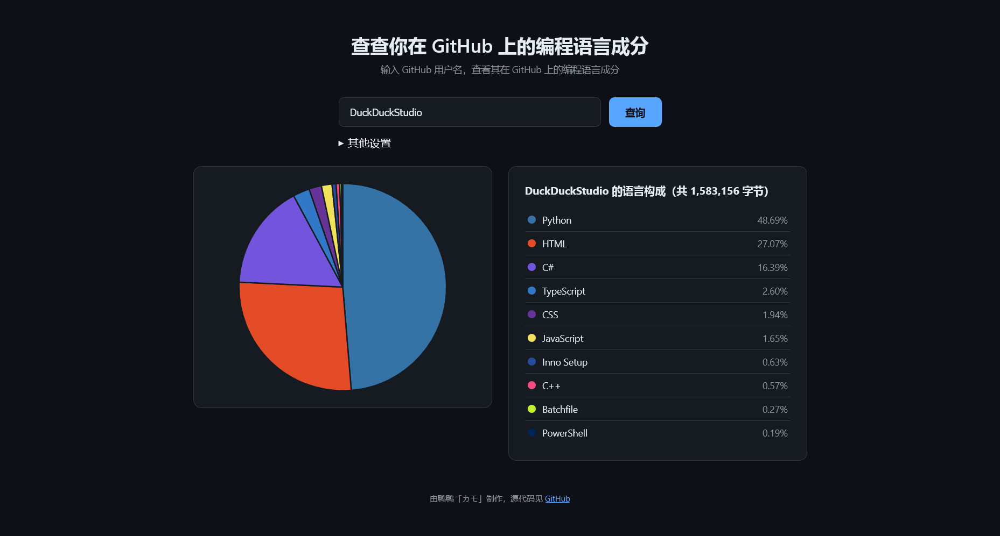

# GitHub 用户语言成分分析

输入 GitHub 用户名，汇总用户的仓库中的各语言字节数，并以饼图和列表的形式展示语言成分构成。

语言数据来自 [GitHub REST API](https://docs.github.com/en/rest/repos/repos?apiVersion=2026-03-10#list-repository-languages)，语言颜色来自 [linguist](https://github.com/github-linguist/linguist/blob/5fbdfcb8133be2bed88bf3ce62b2335f50474525/lib/linguist/languages.yml)。

## 使用说明

输入 GitHub 用户名，然后点击“查询”按钮即可。

[未认证的 API 请求有请求频率限制](https://docs.github.com/zh/rest/using-the-rest-api/rate-limits-for-the-rest-api?apiVersion=2026-03-10#primary-rate-limit-for-unauthenticated-users)，查询的用户有 >60 个仓库时可以填写个人访问令牌提高限额。  
提供的令牌不需要任何权限，只是“代表你发出请求”。

## 使用的开源项目

| 名称                                 | 许可                                                              | 用途         |
|--------------------------------------|-------------------------------------------------------------------|-------------|
| [Chart.js](https://www.chartjs.org/) | [MIT](https://github.com/chartjs/Chart.js/blob/master/LICENSE.md) | 显示结果饼图 |

## 名称来源

gh = GitHub  
l  = Languages = 语言  
p  = Pie graph = 饼图

## 许可

本项目采用 [Apache License 2.0](LICENSE.txt) 许可协议。
